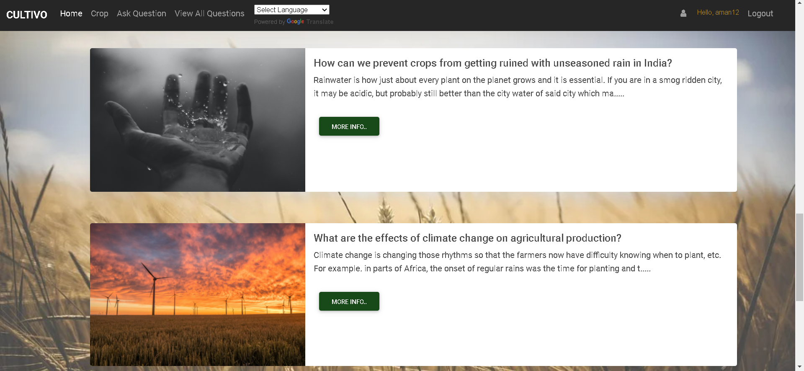

<h1>  CULTIVO <strong> (An initiative for farmers!) </strong></h1>

## PROBLEM STATEMENT  
<p><strong>India is an agriculture based economy with 18% of its Gross Domestic Product (GDP) coming from different
agricultural products. Due to improper management every year crops of rupees in crores are wasted in India. This
causes huge losses on farmers who produce these crops and also affects the Indian Economy. So this is really
important to find the solution and help in any way possible to prevent wastage by proper management. </strong></p>

<p>The main difficulty present among the Indian Farmers is they don’t opt for the proper crop based on the soil
necessities. As per some estimations, about 55% of the total population of India depends on farming. India stands as
one of the biggest producers of agricultural products and still has very less farm productivity. We need to increase
productivity so that farmers can get more pay from the same piece of land with less labour.  </p>

##  SOLUTION
<p>Cultivo application will propose help to farmers in determining the soil
quality by doing analysis on its various parameters and will suggest crops based on the results obtained
using Machine Learning approach. The system will use different classification algorithms and ensemble techniques in order to obtain an accurate and efficient model. The dataset will help in predicting if a crop is going to be profitable or not depending on various factors.</p>

#### 
[Download Dataset](https://www.kaggle.com/datasets/atharvaingle/crop-recommendation-datase) 


<p> Cultivo
application based on different factors will help in predicting the right crop to grow in that specific region.This application is intended to provide the solutions to farmers through a
single gateway using the internet. A person just starting up with farming will take time in making good decisions.
So, they can ask any problem they are facing by just putting the question on the website other users will help them by commenting on their queries . Through this
application we aim to provide direct services using the most suitable technologies and comfortable user experience</p>

###
```
The main functions of the website are:
1. Users can predict suitable crops to grow based on soil nature and the region they want to grow crop in.
2. Users can also convert the whole website in their own language. Language is not the barrier here.
3. Farmers can ask any queries by posting questions.
4. Users can edit or delete the question only the one they posted.
5. Users can add solutions to the listed problems.
6. Users can edit and delete the solution they posted.
7. Others can like the solutions posted.
8. Users can register, login and logout.
9. Users can make their profile on the website.
10. Users can also update the profile later if they want.
11. Used SMTP framework to send mail which allow users to reset password.
12. Viewers can see all the schemes for farmers by the government on the dashboard of the website.
13. Admin will have control over the whole application and will have a record of each user.

```
## BACKEND 

<p align="center">
  <a href="https://www.djangoproject.com/"></a>
</p>
<p align="center">
    <em>With Django, you can take web applications from concept to launch in a matter of hours. Django takes care of much of the hassle of web development, so you can focus on writing your app without needing to reinvent the wheel. It’s free and open source.
</em>

---

**Documentation**: <a href="https://www.djangoproject.com/" target="_blank">https://www.djangoproject.com/</a>

---
  
The key features are:
* **Ridiculously fast**:
Django was designed to help developers take applications from concept to completion as quickly as possible.

* **Fully loaded**:
Django includes dozens of extras you can use to handle common web development tasks. Django takes care of user authentication, content administration, site maps, RSS feeds, and many more tasks — right out of the box.

* **Reassuringly secure**:
Django takes security seriously and helps developers avoid many common security mistakes, such as SQL injection, cross-site scripting, cross-site request forgery and clickjacking. Its user authentication system provides a secure way to manage user accounts and passwords.

* **Exceedingly scalable**:
Some of the busiest sites on the planet use Django’s ability to quickly and flexibly scale to meet the heaviest traffic demands.

* **Incredibly versatile**:
Companies, organizations and governments have used Django to build all sorts of things — from content management systems to social networks to scientific computing platforms.
  
  ## FRONTEND 
  <p align="center">
  <a href="https://www.djangoproject.com/"></a>
</p>
<!-- https://logodix.com/logo/2062436.jpg
https://getbootstrap.com/docs/5.1/assets/img/bootstrap-icons.png -->
<p align="center">
    <em>Bootstrap, the world’s most popular framework for building responsive, mobile-first sites, with jsDelivr and a template starter page.
</em>
  
* Bootstrap is a free and open-source web development framework. It’s designed to ease the web development process of responsive, mobile-first websites by providing a collection of syntax for template designs.

* Bootstrap helps web developers build websites faster as they don’t need to worry about basic commands and functions. It consists of HTML, CSS, and JS-based scripts for various web design-related functions and components.

 ### Some Visualizations
  
 


  


 

  
 ### Screenshots 

  
  
  
  
  
  
  
  
  
  
  
  
  
  
  
  
  
  
  
  
  
 
  ### Setup Locally:

1.Clone/pull/download this repository

2.Create a virtualenv with virtualenv env and install dependencies with pip install -r requirements.txt

3.Configure your .env variables

4.Rename your project with python manage.py rename <yourprojectname> <newprojectname>

5.Run python manage.py runserver
  
6.Make meaningful changes and Create Pull request
  
 
 Drop a ⭐ on the Github Repository.
